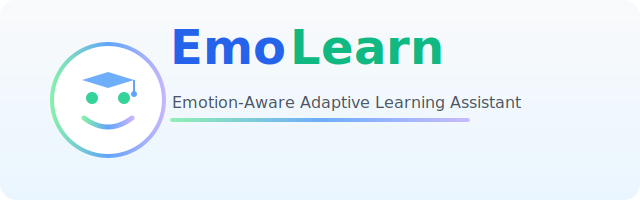
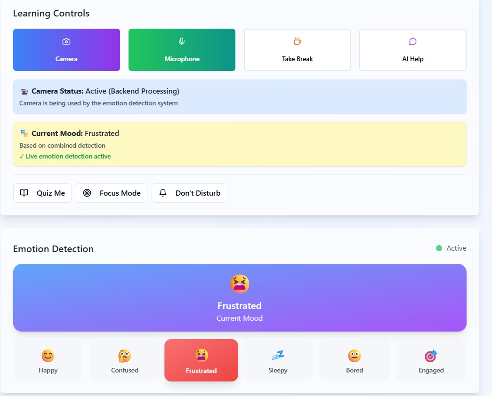
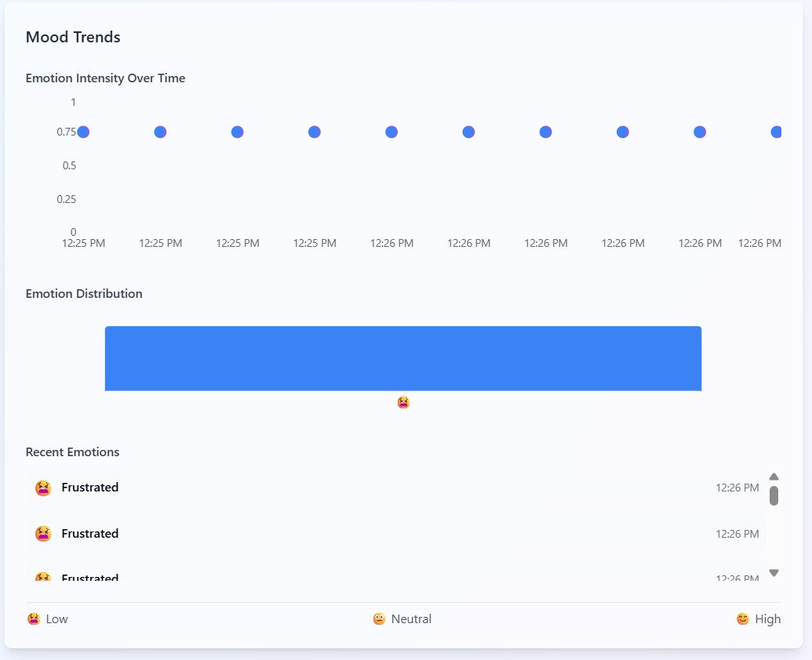
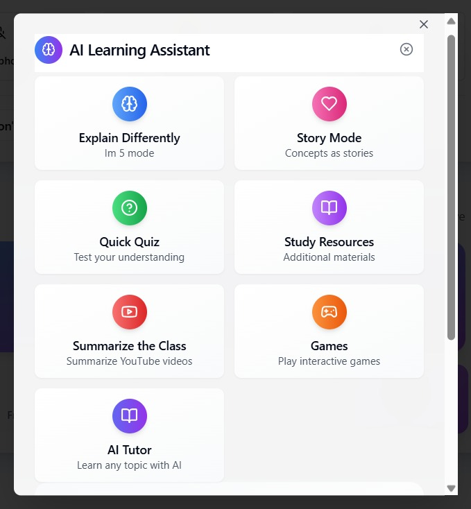
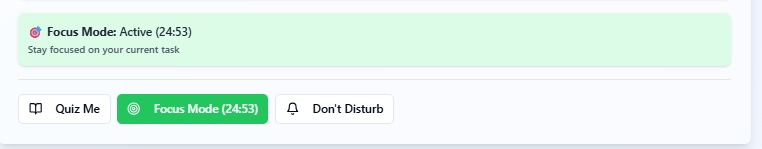
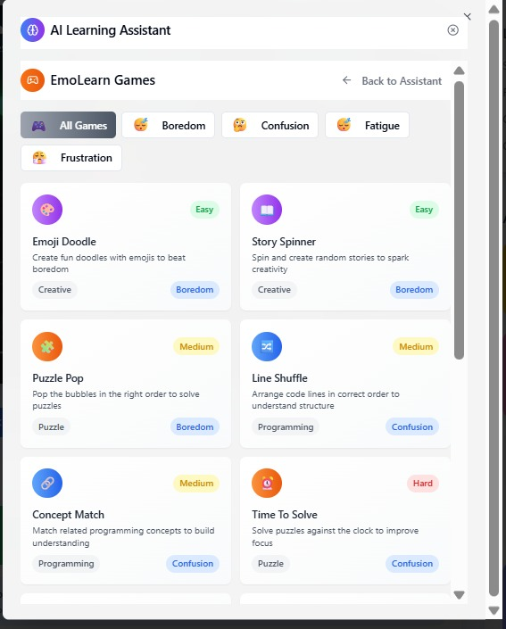
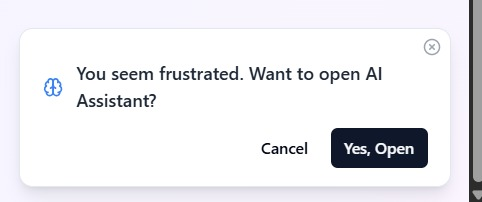

<div align="center">
  
  
  # EmoLearn
  
  <i>Multi-Modal Emotion Detection System Transforming Learning Through Emotion-Driven Innovation</i>
  
  <br>
<!--   
   -->
  <!-- 
   -->
</div>

---
EmoLearn is an advanced AI-powered platform for real-time emotion detection and adaptive learning. By combining facial expression, voice tone, and mouse interaction analysis, it understands user engagement and mood to provide actionable insights. Whenever an emotion is detected, the AI assistant proactively appears to offer support, guidance, or encouragement tailored to the learner’s current state—whether they are confused, bored, or motivated. The assistant helps not only by providing motivation, but also through interactive games and targeted learning support, helping users understand concepts and guiding them toward their best learning condition. Through real-time, personalized interventions such as explanations, motivational messages, and engaging activities, EmoLearn Nexus ensures that help is always timely and relevant, making learning more effective, supportive, and adaptive to each individual's needs.


## 🖼️ Images (Feature Gallery)

> All assets are in `Images/`. The following screenshots preview key features and flows.

**Emotion Detection Dashboard**


_Real-time, multi‑modal emotion detection from face, voice, and interactions._

**Mood Trends & Analytics**


_Historical mood graph to visualize engagement and emotional patterns over time._

**AI Learning Assistant**


_Context-aware assistant offering explanations, resources, quizzes, and calming guidance._

**Alternative Learning Paths**


_Assistant suggests different ways to learn when confusion or frustration is detected._

**Focus / Do Not Disturb Mode**


_Reduce distractions and keep the learner in an optimal state for studying._

**Games Integration**


_Interactive games to re‑engage bored or fatigued learners and improve retention._

**Proactive Assistant Prompt**


_Smart popup invites help when the system detects confusion, boredom, or fatigue._

**Demo Video**

[Watch the Demo Video (MP4)](Images/DEMO_VIDEO.mp4)


## 🎯 Target Market / Target Audience

- **Learners (Students):** Learn more effectively, stay focused, and maintain the best emotional state for studying.
- **Tutors & Educators:** Monitor students’ emotions in real time and adapt lectures to keep classes engaging.
- **Parents:** Gain insights into their child’s emotional well-being and learning journey.
- **Gamers & Game Developers:** Discover which parts of a game are most engaging or frustrating to improve game design and user experience.
- **Corporate Trainers:** Track employee engagement and emotional responses during professional development.
- **Therapists & Counselors:** Monitor emotional states during digital or remote therapy sessions.
- **UX/UI Researchers:** Gather valuable data on user emotions to enhance product interfaces and digital experiences.

## 🚀 Key Features
### Backend (Python, FastAPI)
- **Facial Emotion Detection**: Uses OpenCV, MediaPipe, and DeepFace for real-time webcam-based emotion analysis.
- **Voice Emotion Detection**: Analyzes pitch, ZCR, and keywords from microphone input using librosa, PyAudio, and SpeechRecognition.
- **Mouse Interaction Emotion Detection**: Tracks mouse movement, clicks, and idle patterns to infer engagement or frustration.
- **Emotion Combiner**: Fuses all three modalities with priority logic and logs results to both CSV and JSON.
- **Customizable Emotion Weights**: Tune detection sensitivity via `emotion_weights.json`.
- **FastAPI Server**: `/api/emotion` endpoint returns the current combined emotion.
- **CORS Enabled**: Ready for frontend integration.
- **Structured Logging**: Logs all emotion events for analytics and visualization.

### Frontend (React + TypeScript)
- **Live Emotion Dashboard**: Visualizes current mood, trends, and emotion history.
- **AI Learning Assistant**: Context-aware chatbot that adapts to your mood, offers explanations, quizzes, resources, and stress-relief exercises.
- **Interactive Controls**: Toggle camera/mic, launch breathing exercises, and access quick actions.
- **Progress Badges & Stats**: Earn achievements and track learning streaks, focus, and mastery.
- **Motivational Tools**: Breathing exercises, lofi music, and motivational quotes.
- **Modern UI/UX**: Responsive, accessible, and visually engaging.


## 🏗️ Architecture Overview

```
[ Webcam ]      [ Microphone ]      [ Mouse ]
     |                |                 |
     v                v                 v
[Facial Module]  [Speech Module]  [Mouse Module]
     |                |                 |
     +-------[ Emotion Combiner ]-------+
                     |
                     v
         [ FastAPI Backend /api/emotion ]
                     |
                     v
         [ React Frontend Dashboard ]
```


## 📁 Folder Structure

```
emo-learn-nexus/
│
├── backend/
│   ├── main.py                  # FastAPI backend server
│   ├── emotion_log.csv          # CSV log of emotions
│   ├── emotion_log.json         # JSON log with timestamp & all emotion sources
│   ├── emotion_weights.json     # Customizable keyword weights
│   ├── modules/
│   │   ├── facial_emotion.py    # Facial emotion detection
│   │   ├── mouse_emotion.py     # Mouse activity emotion detection
│   │   ├── speech_emotion.py    # Voice tone and keyword emotion detection
│   │   └── emotion_combiner.py  # Combines all modalities and logs final result
│   ├── static/                  # Optional: legacy HTML/CSS/JS
│   ├── templates/               # Optional: Jinja HTML templates
│   └── requirements.txt         # Python dependencies
│
├── src/                        # React frontend
│   ├── components/              # UI components (dashboard, assistant, etc.)
│   ├── pages/                   # Main pages (Index, NotFound)
│   ├── api/                     # API integration (Groq GPT, etc.)
│   ├── assets/                  # Static assets (audio, images)
│   └── ...
└── README.md
```


## 🔧 Installation & Setup

### Backend (Python)
1. **Create and activate a virtual environment**
   ```bash
   cd backend
   python -m venv venv
   venv\Scripts\activate  # or source venv/bin/activate on Mac/Linux
   ```
2. **Install dependencies**
   ```bash
   pip install -r requirements.txt
   ```
3. **Start FastAPI server**
   ```bash
   uvicorn main:app --reload
   ```
   The API will be available at [http://localhost:8000/api/emotion](http://localhost:8000/api/emotion)

### Frontend (React)
1. **Install dependencies**
   ```bash
   npm install
   ```
2. **Start the development server**
   ```bash
   npm run dev
   ```
   The app will be available at [http://localhost:5173](http://localhost:5173)


## 🧠 Usage & Modules

### Running Individual Backend Modules
- **Facial Emotion Detection**
  ```bash
  python modules/facial_emotion.py
  ```
- **Voice Emotion Detection**
  ```bash
  python modules/speech_emotion.py
  ```
- **Mouse Emotion Detection (Simulated)**
  ```bash
  python modules/mouse_emotion.py
  ```
- **Combined Emotion Detection**
  ```bash
  python modules/emotion_combiner.py
  ```

### API Endpoint
| Method | Endpoint         | Description                  |
|--------|------------------|------------------------------|
| GET    | /api/emotion     | Returns current combined emotion |


## 📦 Emotion Log Format

- **JSON** (`backend/emotion_log.json`):
  ```json
  [
    {
      "time": "2025-06-28 15:00:04",
      "facial_emotion": "Bored",
      "voice_emotion": "Sleepy",
      "interaction_emotion": "Bored",
      "final_emotion": "Bored",
      "value": 0.45
    }
  ]
  ```
- **CSV** (`backend/emotion_log.csv`):
  ```csv
  timestamp,emotion,source
  2025-06-25 22:43:38,Bored,mouse
  2025-06-25 22:44:08,Sleepy,mouse
  ...
  ```


## 🧩 Frontend Features
- **Live Mood Tracker**: Real-time display of detected emotion (😊 🤔 😫 💤 😐)
- **AI Assistant**: Context-aware chatbot with interventions (explain, quiz, resources, breathing)
- **Control Panel**: Toggle camera/mic, launch breathing, quick actions (quiz, focus, DND)
- **Mood Graph**: Visualizes mood trends over time
- **Progress Badges**: Earn achievements for focus, calm, curiosity, etc.
- **Breathing Exercise**: Timer, lofi music, motivational quotes, reflex mini-game
- **Voice Input**: Ask questions by voice (browser speech recognition)
- **Notifications**: Toasts and alerts for feedback

---

## 🛠️ Customization
- **Emotion Weights**: Edit `backend/emotion_weights.json` to tune keyword sensitivity for each emotion.
- **Motivational Quotes**: Add/edit quotes in `src/components/quotes.json` for the breathing exercise.
- **Lofi Music**: Replace `src/assets/lofi.mp3` with your own audio for relaxation.

---

## 🤝 Contributing
- Fork the repo and create a feature branch.
- Follow code style and add clear comments.
- Submit a pull request with a detailed description.

---

## 📚 Credits
- **Backend**: FastAPI, OpenCV, MediaPipe, DeepFace, librosa, PyAudio, SpeechRecognition, torch
- **Frontend**: React, TypeScript, TailwindCSS, Radix UI, Sonner, Recharts
- **AI Assistant**: Groq API (Llama3-70B)

---

## 🏅 Hackathon Achievement

I had the privilege of participating in HacKronyX – a National Level Hackathon that saw over 3,300+ teams from across the country. Our team, Code., made it all the way to the final round hosted at St. Vincent Pallotti College of Engineering & Technology, Nagpur.

During the 36‑hour hackathon, we developed EmoLearn – an Emotion‑Aware Learning Platform designed to integrate emotional intelligence into the learning process, making education more adaptive and impactful.

After an intense competition, we secured the 8th position nationally.


## 👥 Contributors (Hackathon Team)

- [Rohith Macharla](https://github.com/RohithMacharla11)
- [Shiva Chaithanya Vangala](https://github.com/Shiva-vangala)
- [Nagaraju Narishetti](https://github.com/NagarajuNarishetti)
- [Arun Kumar Pentkar](https://github.com/arunpentkar)
- [Harshavardhan Jakku](https://github.com/Harshavardhanjakku)

---

<!-- ## 📄 License
MIT License. See [LICENSE](LICENSE) for details. -->
